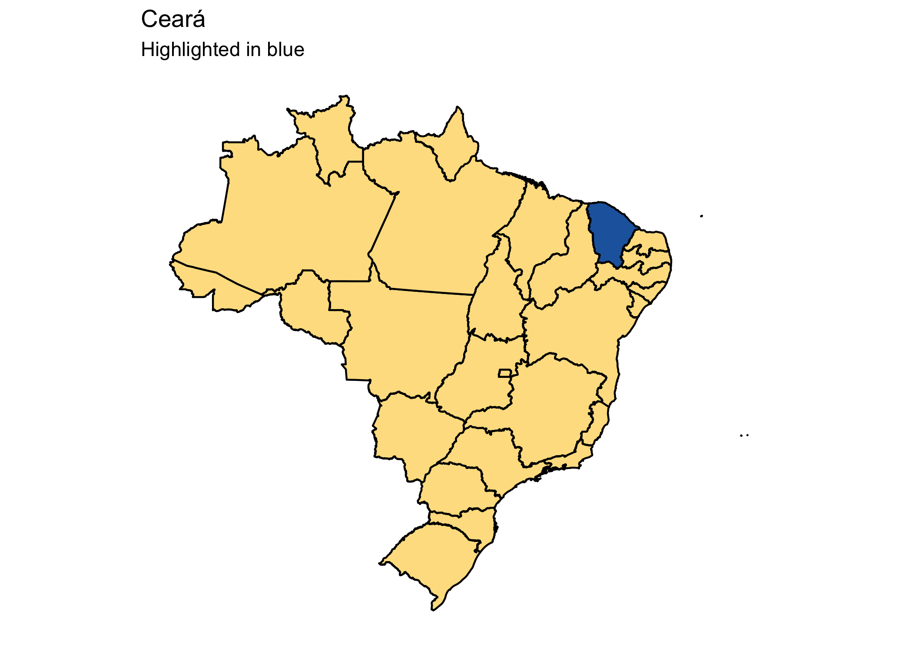
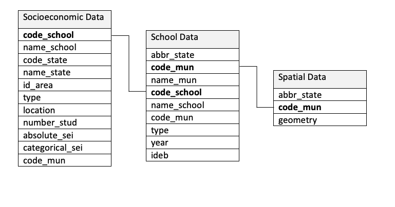
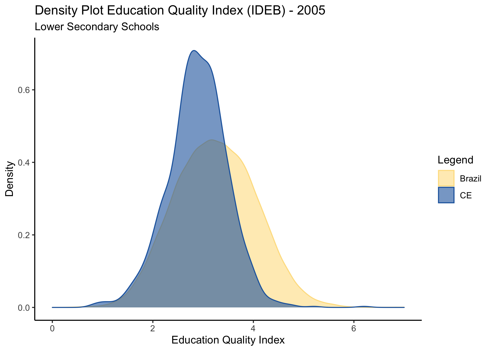
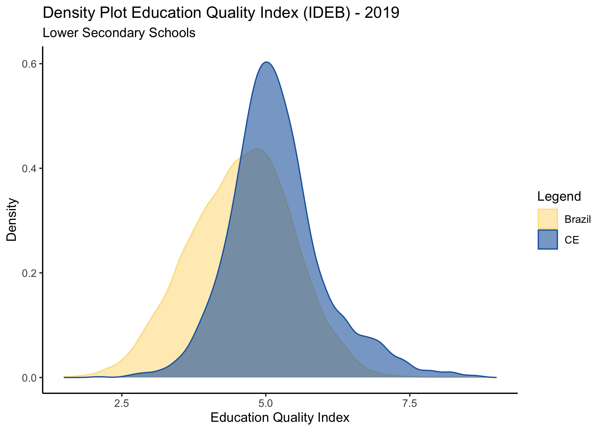
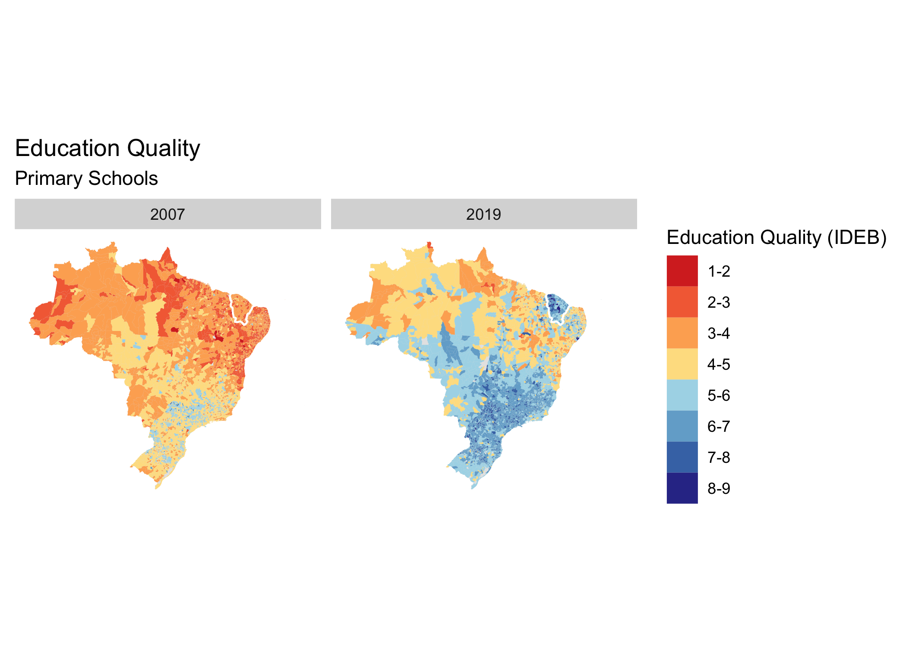
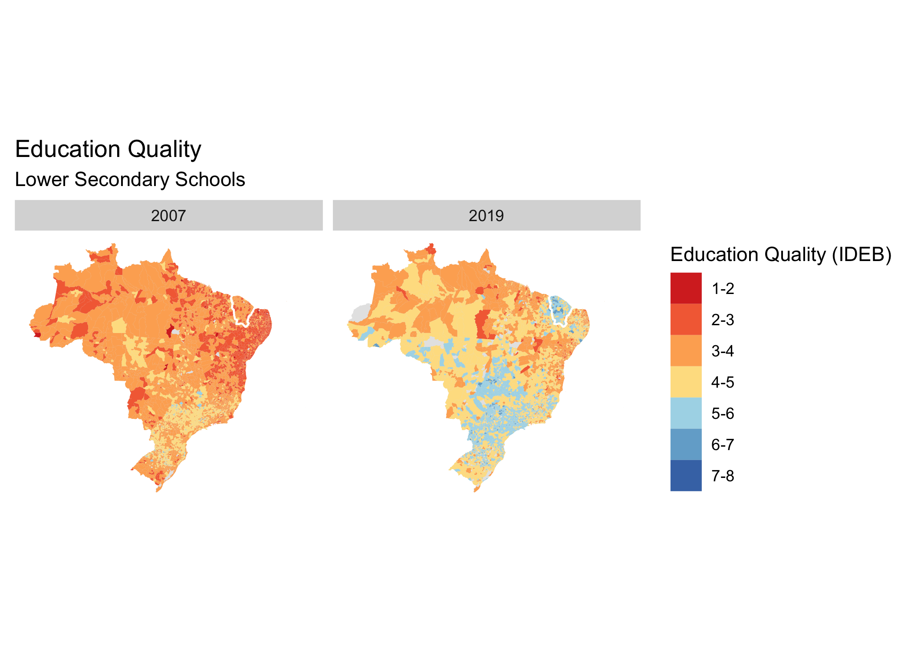
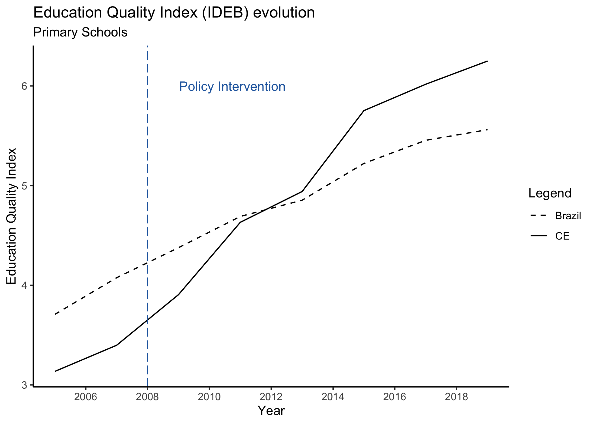
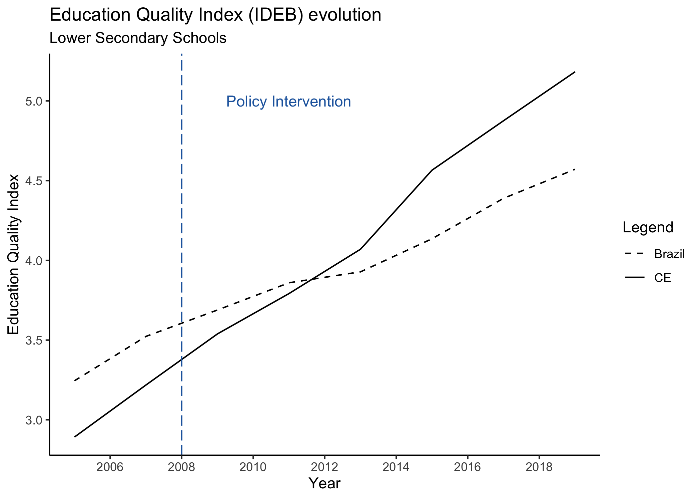
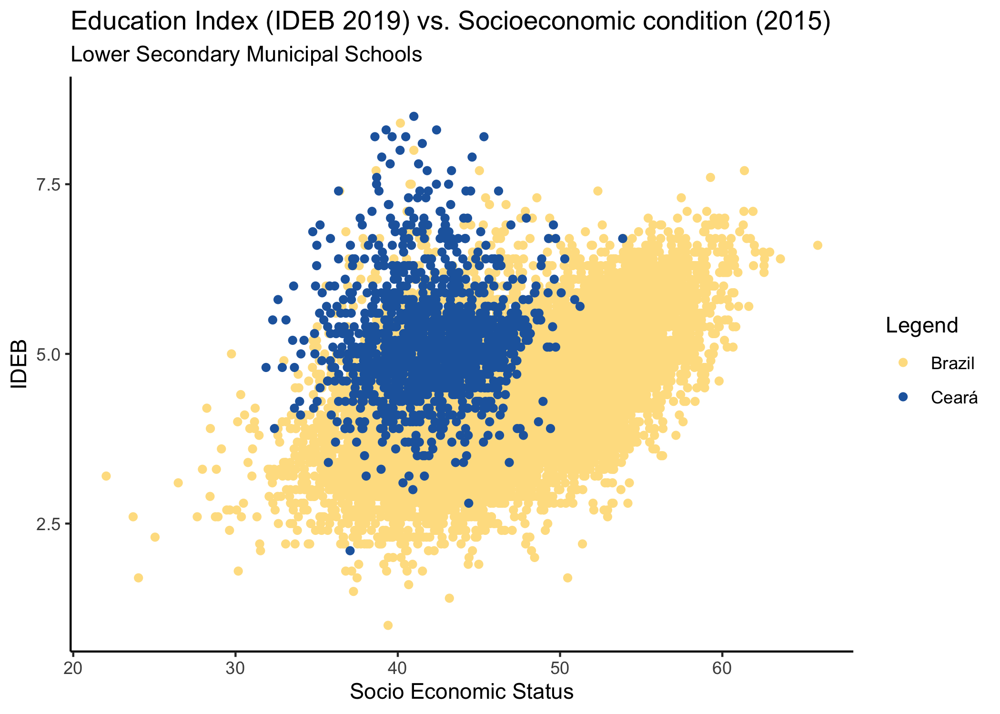
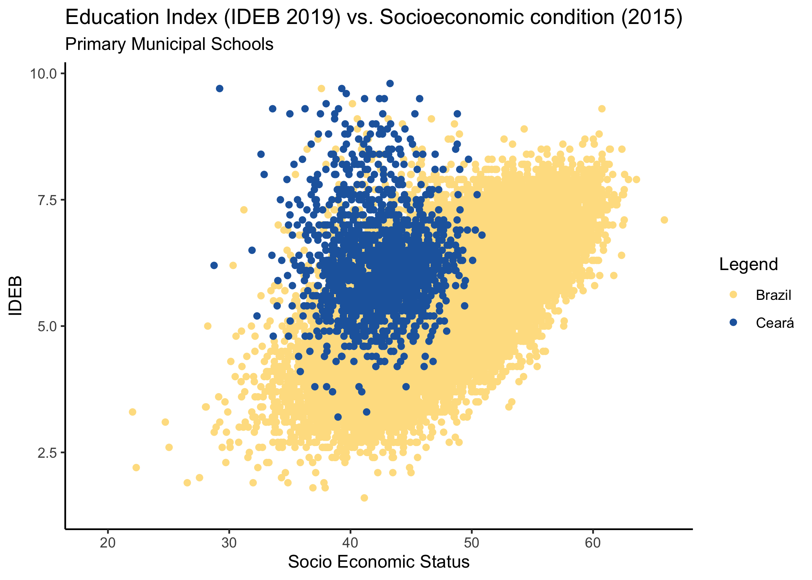

```{r setup, include=FALSE}
knitr::opts_chunk$set(echo = TRUE)

# Loading necessary libraries:
library(tidyverse) 
library(rvest)
library(stringr)
library(readxl)
library(naniar)
library(sf)
library(stargazer)

# Loading necessary functions:
source("func/load_sei.R")
source("func/load_ideb_lsecondary.R")
source("func/load_ideb_primary.R")

sei                  <- load_sei()
ideb_lower_secondary <- load_ideb_lsecondary()
ideb_primary         <- load_ideb_primary()

source("func/plot_density_2005.R")
source("func/plot_density_2019.R")
source("func/regress_index.R")
source("func/plot_time_series.R")
source("func/plot_socioeconomic_vs_ideb.R")
source("func/spatial_data.R")
source("func/plot_ceara.R")
source("func/na_tables.R")

plot_time_series()
plot_density_2005()
plot_density_2019()
spatial_data()
plot_socioeconomic_vs_ideb()
plot_ceara()

```
<br>

The complete files to this analysis can be found on: https://github.com/bruno-ponne/Introduction-to-Data-Science

### The reforms in Ceará, Brazil
<div style="color:#4E4C4C; text-align: justify">

Around 2007, the government of Ceará, a state in the northeastern part of Brazil, started a series of reforms in its education system. These reforms comprised five main pillars: fiscal incentives to municipalities based on outcomes; technical assistance for municipalities; more autonomy and accountability for local systems; regular monitoring of learning in order to collect actionable data, and elimination of political influence in the choice of principals and teachers.

In the analysis that follows, I employ data collected by the Brazilian government concerning the quality of education (IDEB - Índice de Desenvolvimento da Educação Básica) and data that might impact student outcomes, like socioeconomic level of the school/region.

The objective is to describe how the education quality evolved through time, get insights about the data and associations between the variables.

</div>


```{r, out.width='70%', out.height='70%',fig.align='center', fig.cap='', echo=FALSE}

```

### Data

<div style="color:#4E4C4C; text-align: justify">
The data used in this analysis is made available by the Ministry of Education of Brazil and the Brazilian Institute of Geography and Statistics. Bellow, there is a representation of how data sets connect to each other. In order to tidy data, I employed the function **gather()** that creates a data frame in which each observation has its own row. In order to join data sets, I employed **left_join()** using the keys highlighted in the scheme bellow.
</div>

```{r, out.width='70%', fig.align='center', fig.cap='', echo=FALSE}

```


### Distribution of the education index

<div style="color:#4E4C4C; text-align: justify">
As a first analysis, I explore the distribution of education quality index in 2005, before intervention, for Ceará and for Brazil (excluding Ceará). In order to do that, I use density plots. Observing the graph bellow, as expected, Brazil has greater standard deviations from the mean because it is composed by 26 different states. Ceará has a much smaller variance in its distribution. The mean results of Ceará are lower compared to the Brazilian average. The distributions are centered around 3.
</div>


```{r, out.width='70%', fig.align='center', fig.cap='', echo=FALSE}

```

<div style="color:#4E4C4C; text-align: justify">
Below, the distribution of indexes in 2019 can be seen (after intervention). Both indexes improved considerably in the period. Now the distributions are centered around 5. The average index of Ceará, however, improved more compared to the average in Brazil. The probability of finding an index higher than 7, for example, is a lot higher in Ceará data.
</div>


```{r, out.width='70%', fig.align='center', fig.cap='', echo=FALSE}

```

### OLS: Ceará vs. Brazil

<div style="color:#4E4C4C; text-align: justify">
Here we can observe the results of a linear model that shows the association between being the state of Ceará and the quality of education index both in 2005 and in 2009. We can observe that initially, in 2005, being located in Ceará meant a decrease of -0.35 in the performance of a school. In 2019, this association changed direction and increased considerably: being located in Ceará is now associated with a 0.61 increase in the education index. 

If we control for human development index (HDI), being a school in Ceará in 2019 is associated with an increase of 0.89 in the quality of education compared to the rest of the country. This means that when we compare schools with similar HDIs, there is a stronger positive association of being located in Ceará and the education quality index. We cannot interpret, however, that the reforms in Ceará caused a 0.89 increase in the quality of education, because there are more confounders affecting this relation.
</div>


<style type="text/css">
td
{
    text-align: center;
    padding:0 50px 0 50px;
}
</style>
<div >
```{r, results='asis', strip.white=TRUE, tidy=TRUE, echo=FALSE}
regress_index()
```
</div>


### Spatial Data: Ceará vs. Brazil

<div style="color:#4E4C4C; text-align: justify">
The following maps show the geographical area of Brazil colored according to the average education quality index of each municipality. Blue is associated with a good index and red with a poor one. We can tell that the country had an overall improvement from 2005 to 2019 both for primary and lower secondary school.

Ceará is highlighted at the top right of the map and it is visible that this state has improved more compared to other states, specially its neighbors.
</div>


```{r, out.width='100%', fig.align='center', fig.cap='', echo=FALSE}


```

### Time Series: Ceará vs. Brazil
<div style="color:#4E4C4C; text-align: justify">
In this section, I explore how the education quality index evolved through time before and after the intervention in Ceará. The averages of Ceará are compared to the average index of all other Brazilian states (except Ceará). Before intervention, the trends follow a parallel development although the curves are not perfectly parallel. Unfortunatelly there are only two observation before intervention: 2005 and 2007.
</div>


```{r, out.width='70%', fig.align='center', fig.cap='', echo=FALSE}


```

### Education Quality vs. socioeconomic level
<div style="color:#4E4C4C; text-align: justify">
In this section, I analyse the education quality index as a function of the socioeconomic level of the school for Ceará and for the rest of Brazil. What can be seen is that schools in Ceará have a lower socioeconomic level, but a higher education index compared to the rest of the country. The best primary and lower secondary school in 2019 are located in Ceará.
</div>


```{r, out.width='70%', fig.align='center', fig.cap='', echo=FALSE}


```

### NAs analysis
<div style="color:#4E4C4C; text-align: justify">
Here I present the proportions of missing values (NA) relative to the number of observations for each state regarding the primary schools. Some states have more than 50% of missing values. It appears that poorer states have a bigger proportion of NAs. In the second table, the same information is presented, but regarding the Lower Secondary Schools. Again, it appears that poorer states have a bigger proportion of NAs. 
</div>

```{r xtable, results="asis", echo=FALSE, message=FALSE, warning=FALSE}

print(na_primary(), type="html", caption.placement = "top")


print(na_secondary(), type="html", caption.placement = "top")

```

### Conclusion
<div style="color:#4E4C4C; text-align: justify">
As just presented, the reforms in Ceará appear to have had a positive impact in Ceará. The spatial data shows a blue island of good education indexes in the treated state. The time series show a much more inclined line of increase for Ceará, compared to Brazil. Estimating the true impact is, however, more complex because we must account for any source of endogeneity that might be affecting both treatment assignment and the outcome of interest. Predictors of education quality index should also be balanced between control and treatment group. One possible approach to continue this investigation is to apply a fixed effect model. It is also important to investigate whether NAs are associated to poor performing municipalities and how NAs develop before and after intervention. To sum up, this was an informative descriptive analysis of the reforms in the education system of Ceará and a first step to analyse its impacts in student achievement.
</div>

